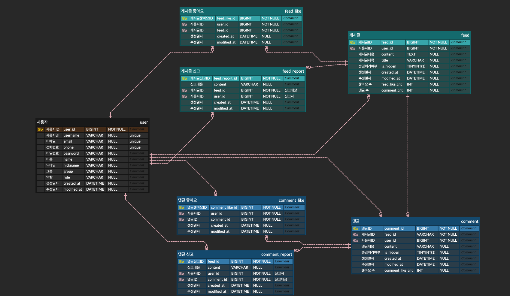

# ⭐ Ourverse

---

팬과 아티스트를 연결해주는 SNS 어플리케이션입니다.
(Weverse와 유사한 서비스)

## 프로젝트 기능 및 설계

---

#### 회원가입 기능
  - 사용자는 FAN과 ARTIST로 구분되며, 서로 각각 회원가입을 할 수 있다. 
  - 회원가입시 가입 종류에 따라 FAN 권한과 ARTIST 권한으로 나뉜다.
  - 회원가입시 아이디와 패스워드를 입력받는다.
    - 회원가입 시 사용되는 아이디, 전화번호, 이메일은 unique 해야한다.
  - ARTIST는 최초 회원가입 시, DB에 미리 등록된 GROUP들 중 단 하나의 GROUP에 속해있어야한다.
    - 예 : 진 - BTS, 뷔 - BTS, 장원영 - IVE
  - 회원가입시 사용되는 닉네임도 unique 하다.
  - 모든 서비스는 로그인이 돼야 이용할 수 있다.

#### 로그인 기능
  - 사용자는 로그인을 할 수 있다. 로그인은 FAN 로그인과 ARTIST 로그인이 구분되어 구현한다. 
  - 로그인시 회원가입때 사용한 아이디(=이메일 혹은 전화번호 혹은 아이디 사용)와 패스워드가 일치해야한다. 

#### 그룹 기능
  - ARTIST들은 속해있는 GROUP이 존재하며, 가입된 ARTIST들은 모두 GROUP에 속해있어야한다.
  - FAN들은 원하는 GROUP에 가입할 수 있다.
  - 각 GROUP들은 FAN 게시판과 ARTIST 게시판을 가지고 있다.
  - 게시판의 기능들은 모두 GROUP 단위로 사용할 수 있다. FAN들은 GROUP에 가입하여, GROUP 내의
    ARTIST의 게시글과 ARTIST의 FAN들의 게시글을 읽을 수 있다.

#### 그룹 검색 기능
  - FAN은 DB에 등록된 모든 가입 가능한 GROUP들을 검색할 수 있다.

#### 게시판 게시글 작성 기능 
  - 게시판은 FAN 게시판과 ARTIST 게시판으로 나뉜다.
    - 로그인한 사용자의 권한이 FAN인 경우, FAN 게시판에 게시글 제목(텍스트), 게시글 내용(텍스트)를 작성할 수 있다.
    - 로그인한 사용자의 권한이 ARTIST인 경우, ARTIST 게시판에 게시글 제목(텍스트), 게시글 내용(텍스트)를 작성할 수 있다.

#### 게시글 목록 조회 기능 
  - 해당 GROUP에 가입한 로그인한 모든 사용자들은 모든 게시판에 접근하여 게시글을 조회할 수 있다. 
  - 게시글은 최신순으로 기본 정렬되며, 댓글이 많은순/적은순 으로도 정렬이 가능하다.
  - 게시글 목록 조회시 응답에는 게시글 제목과 작성일, 댓글 수, 좋아요 수의 정보가 필요하다.
  - 게시글은 종류가 많을수 있으므로 paging 처리를 한다. 

#### 특정 게시글 조회 기능
  - 해당 GROUP에 가입한 로그인한 모든 사용자들은 모든 게시판에 접근하여 게시글을 조회할 수 있다. 
  - 게시글 제목, 게시글 내용, 작성자, 작성일, 좋아요 수가 조회된다. 

#### 댓글 목록 조회 기능
  - 특정 게시글 조회시 댓글목록도 함께 조회가 된다. 다만 댓글은 많을 수 있기 때문에 별도의 API로 구성한다. 
  - 해당 GROUP에 가입한 로그인한 모든 사용자들은 모든 게시판에 접근하여 댓글들을 조회할 수 있다.
  - 댓글은 최신순으로만 정렬되며, paging 처리를 한다. 단, ARTIST들의 댓글은 항상 최상단에 위치한다.
  - 댓글 목록 조회시에는 댓글 작성자와 댓글 내용, 댓글 작성일, 좋아요의 정보가 필요하다.

#### 좋아요 기능
  - 게시글과 댓글에 좋아요를 누를 수 있다. 개별적으로 좋아요를 count할 수 있다
  - 좋아요를 취소할 수도 있다.

#### 댓글 작성 기능
  - 해당 GROUP에 가입한 로그인한 모든 사용자들은 모든 게시판에 접근하여 댓글들을 작성할 수 있다. 
  - 댓글 내용(텍스트)를 작성할 수 있다.

#### 신고 기능
  - 해당 GROUP에 올라온 게시글이나 댓글에 대해 신고를 할 수 있다.
  - 특정 게시글이나 댓글의 신고 횟수가 10회가 넘어가면 숨김처리 돼 해당 게시글 및 댓글을 조회할 수 없게 된다.
  - 신고는 신고내용, 신고자 정보, 신고 대상의 종류가 필요하다.

#### 신고 목록 조회 기능
  - ADMIN은 등록된 모든 신고를 최신순으로 조회할 수 있다.
  - 신고는 게시글을 조회할 수 있다.

#### 어드민 기능
  - ADMIN 권한을 가진 사용자는 등록된 모든 기능들에 대해 CRUD를 진행할 수 있다.

## ERD 

---

## Trouble Shooting

---

[go to the trouble shooting section](doc/TROUBLE_SHOOTING.md)

## Tech Stack

---

 
   
  
  

  
  
   
  

  
  
  

